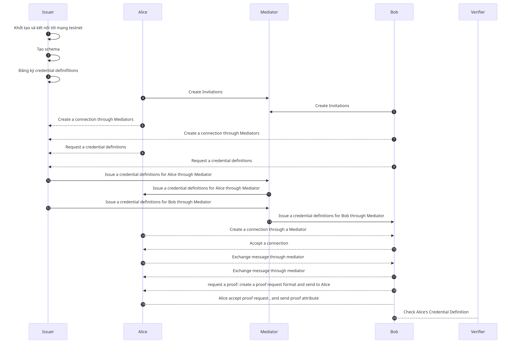
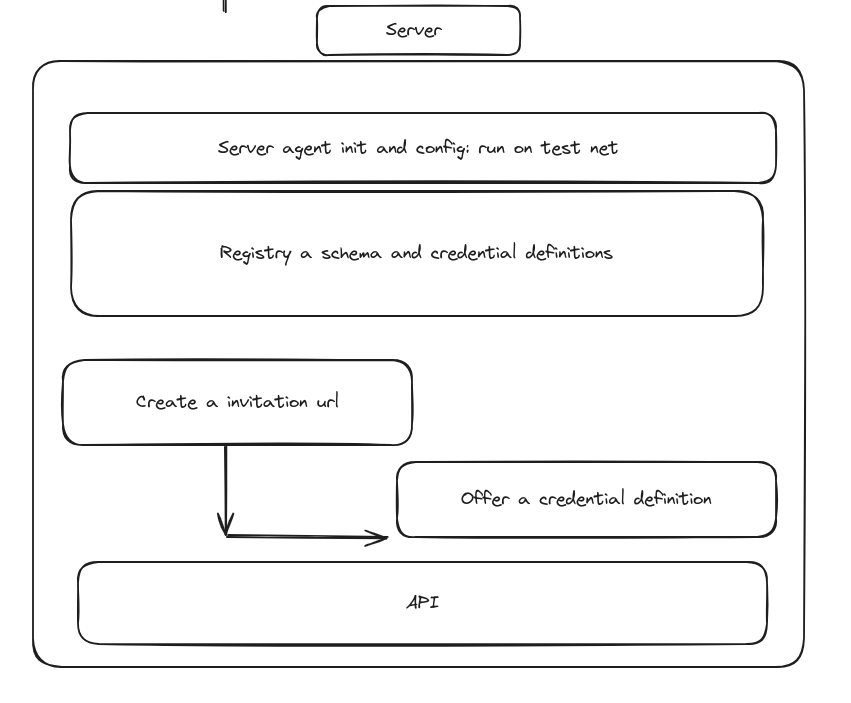
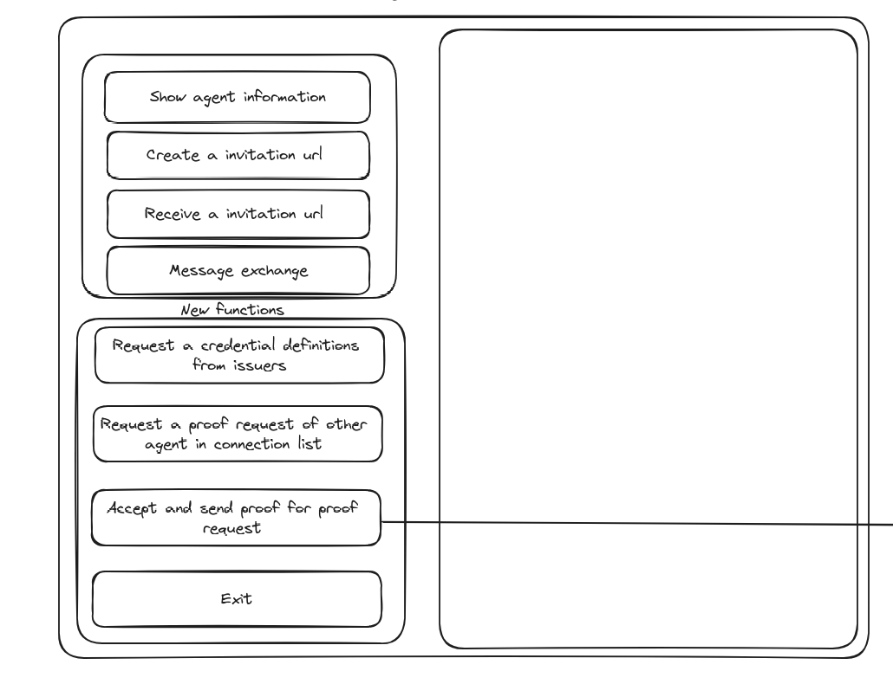
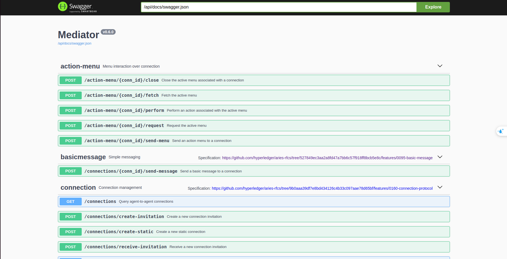

# Readme 
## Overview
- ChatApp based on Decentralized Identity
  - React, Electron, ...
  - Aries Framework JavaScript version 0.4.0
  - Bcovrin Testnet
  - ACA-py
- In this case, we use the nodejs environment to develop the holder agent application (similar to react-native for mobile agents) using the aries framework javascript version 0.4.0
## Project Setup

- Desktop App
  - React
  - Electron.js project
  - Aries Framework JavaScript
- Back-end
  - Aries Framework JavaScript
  - Express
- Mediator


## Diagram Flow
- Diagram Flow Example (Incomplete)



- Server Agent and Holder Agent (Desktop app)




## Server Agent


## Holder Agent

## Verifier Agent

## Mediator

- Mediator: Use ACA-py to build a mediator as an intermediate connection between agents without endpoints (mobile agents).
- Mediator demo: run mediator.sh and access to localhost:11000 

- Usage
  - Create a new connection invitation (Agent to Agent)



  - Use connection invitation url in code
```typescript
const agent = new Agent({
        config,
        dependencies: agentDependencies,
        modules:{
            mediationRecipient: new MediationRecipientModule({
                mediatorInvitationUrl, // connection invitation url 
            }),
        //...
        }
        //...
        })

// Agent create a invitation connection Url 
export async function createNewInvitation(agent: Agent) {
    const outOfBandRecord = await agent.oob.createInvitation();
    return {
      invitationUrl: outOfBandRecord.outOfBandInvitation.toUrl({
        domain: "ws://127.0.0.1:8000/",
      }),
      outOfBandRecord,
    };
};
```

## References
- Read more: [AnonCreds Specification](https://hyperledger.github.io/anoncreds-spec/)
- Read more: [SSI:Self-Sovereign Identity Decentralized digital identity and verifiable credentials (Alex Preukschat, Drummond Reed)](https://www.manning.com/books/self-sovereign-identity)

